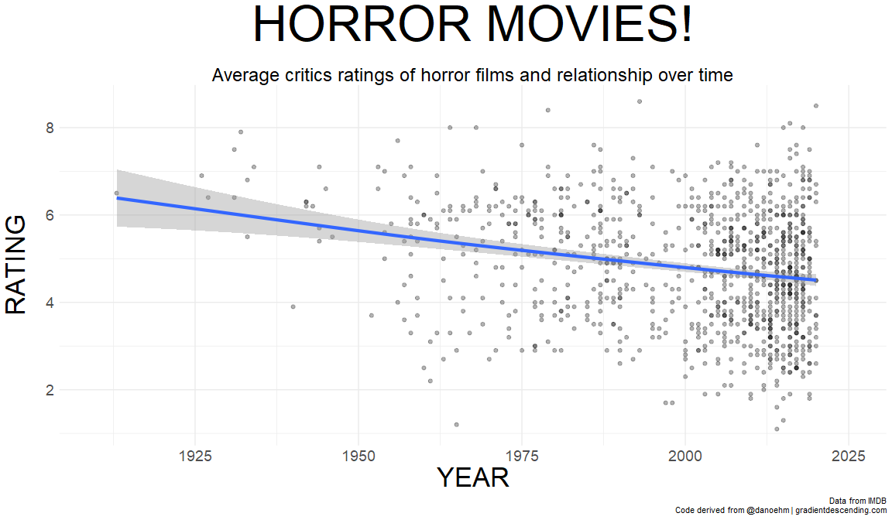
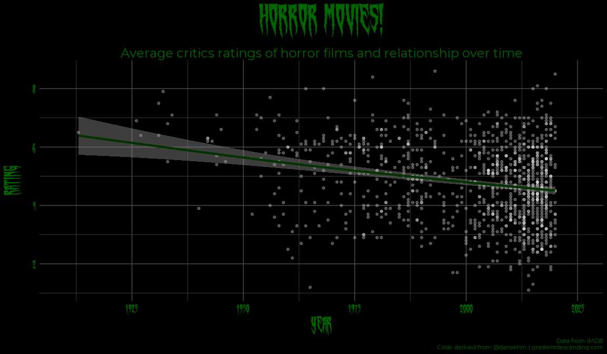
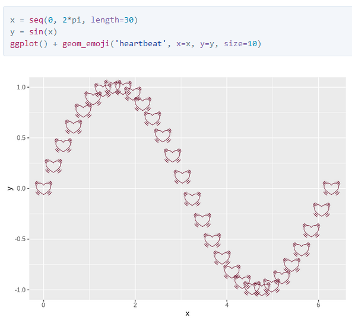
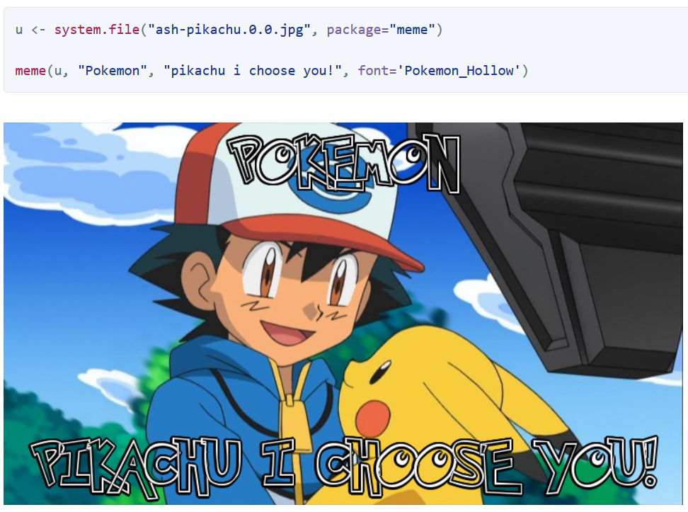
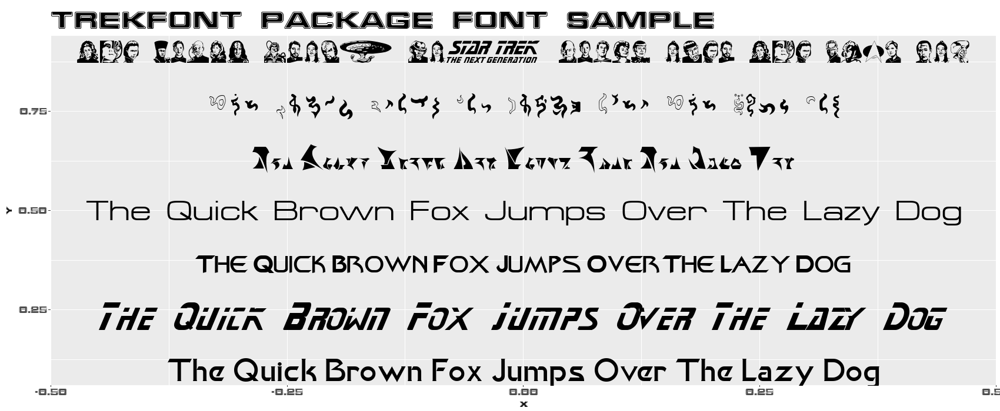
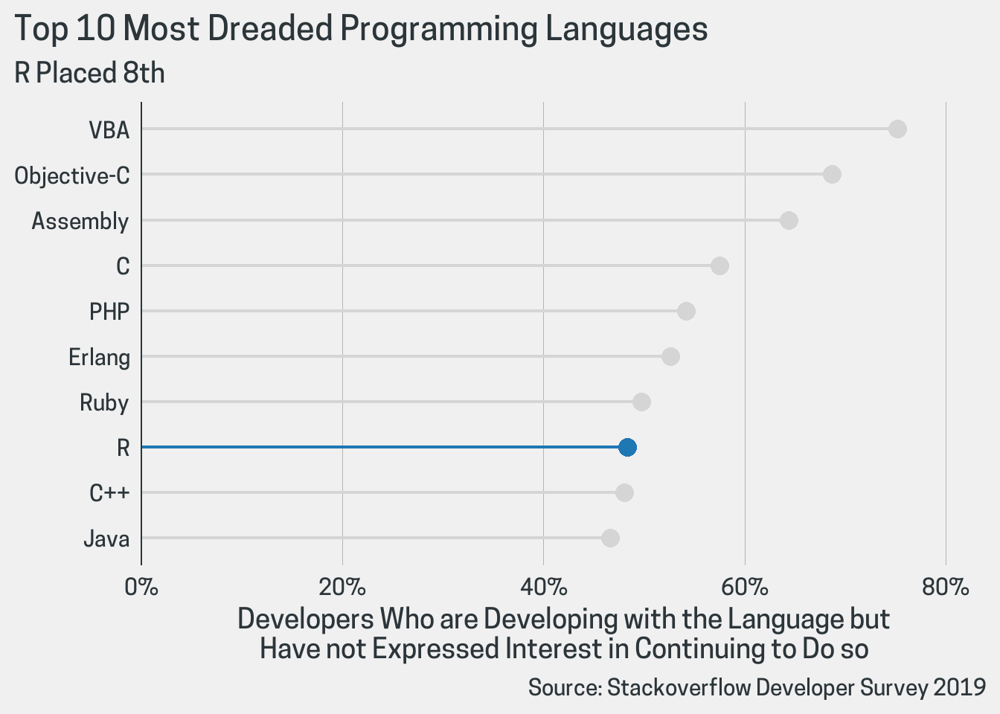
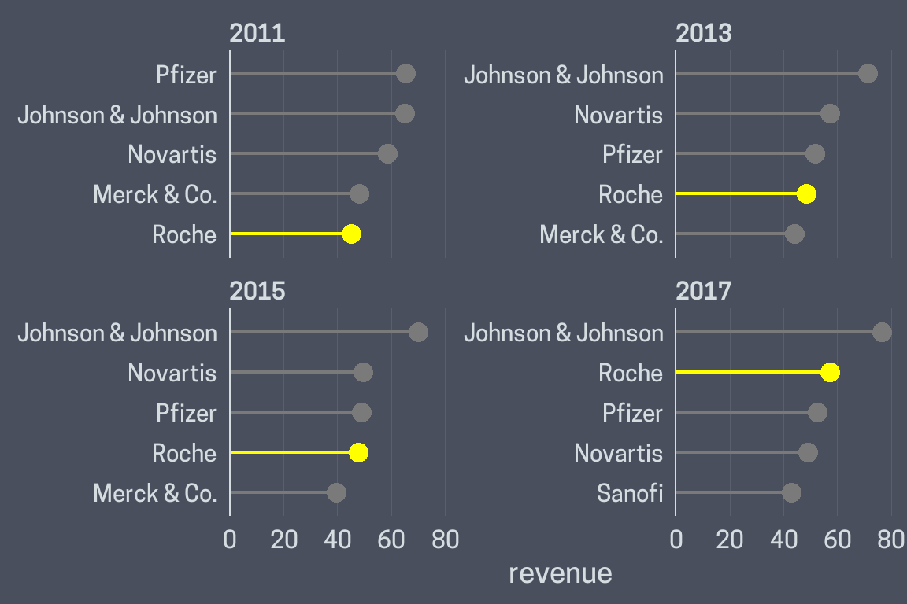
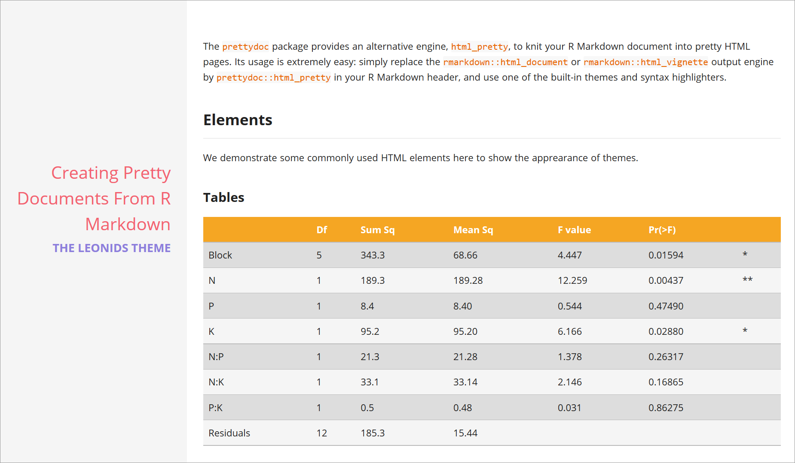
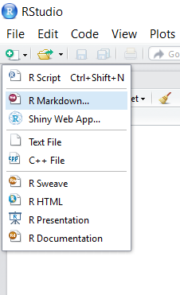
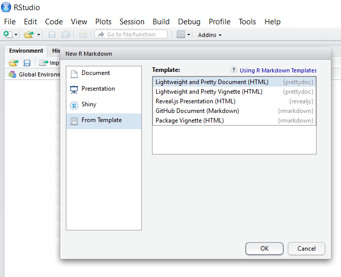

class: center, middle

<image width="60%" src="images/face-sticker.png" />

```{r setup, include=FALSE}
library(showtext)
```

---
class: inverse, center, middle

# Get Started

---

# A Typical Data Visualization

.center[]

???

Code derived from http://gradientdescending.com/adding-custom-fonts-to-ggplot-in-r/

---
class: inverse

# Let's Change the Fonts

.center[]

http://gradientdescending.com/adding-custom-fonts-to-ggplot-in-r/

---

# Why Changing Fonts was Hard in R

--

- Device dependent

  - `windowsFonts()` for `windows()` devices
  - `X11Fonts()` for `X11()` devices
  - `quartzFonts()` for `quartz()` devices
  - `postscriptFonts()`, `pdfFonts()`, etc.

--

- Many difficulties for the PDF device

  - Limited choices, `names(pdfFonts())`
  - Does not support TTF/OTF fonts
  - Needs to embed fonts using Ghostscript

--

- Ambiguity of font names

- Reproducibility

  - Other people need to install the same fonts to use your code

---

# Hello, World

```{r dev='svg', fig.width=9, fig.height=4, out.width='80%', fig.align='center', message=FALSE}
library(showtext)
# download.file("http://simonsoftware.se/other/xkcd.ttf",
#               "fonts/xkcd.ttf", mode = "wb")
font_add(family = "xkcd", regular = "fonts/xkcd.ttf")  #<<
font_add_google(name = "Turret Road")                  #<<
showtext_auto()                                        #<<

pie(c(0.9, 0.1), col = c("#F8766D", "#00BFC4"), radius = 1, border = NA,
    labels = c("Test Internet connection", "Find useful information"),
    family = "xkcd", cex = 2)
title("When you visit google.com", family = "Turret Road", cex.main = 2.5)
```

???

https://www.pinterest.com/pin/127719339412665422/

---
class: center, middle

# What's Happening Here?

---

# Core Functions

--

- `font_add()`: Register a font file

  - `family`: The family name you want to use in R
  - `regular`: Font file for the "regular" font face
  - `bold`: Font file for the "bold" font face
  - ...

--

- `font_add_google()`: Register a font from [Google Fonts](https://fonts.google.com/)

  - `name`: The font name in the Google Fonts database
  - `family`: The family name you want to use in R

--

- `showtext_auto()`: Enable `showtext`. **That's it!**

- `showtext_opts(dpi = 200)`: If you need to adjust the DPI

---

# How showtext works

<div class="center">
<image width="80%" src="images/internal.png" />
</div>

--

- .warning[Caveat: text is no longer searchable in `showtext`-enabled plots]

---
class: middle, center

# Fantastic Fonts

### and Where to Find Them

---

# Font Resources (for free)

- Explore your local machine using `font_files()`

- Google Fonts (https://fonts.google.com/)

- Font Squirrel (https://www.fontsquirrel.com/)

- DaFont (https://www.dafont.com/)

- 1001 Fonts (https://www.1001fonts.com/)

- Many others

---

# Useful Utilities

--

- `font_families()`: List registered font families
```{r echo=FALSE}
font_families()
```

--

- `font_files()`: List font files that are available in the system
```{r echo=FALSE}
head(font_files())[, 1:5]
```

--

- `font_install()`: Install fonts to the local machine (more details later)

---

# Save Frequently Used Fonts

- Suppose you have a Google font that is used frequently

- You don't want to download it every time you use it

--

- `showtext` allows you to install it to the `showtextdb` package
```{r eval=FALSE}
opensans = google_fonts("Open Sans")
font_install(opensans)
list.files(system.file("fonts", package = "showtextdb"))
```
```{r echo=FALSE}
list.files(system.file("fonts", package = "showtextdb"))
```
```{r}
font_families()
```

---

# Save Frequently Used Fonts - cont.

- You can put any local fonts under the `fonts` folder of the `showtextdb` package

- They will be automatically loaded by `showtext`

- The directory name is the font family, with `regular.ttf`, `bold.ttf` etc. files inside the directory
```{r}
list.files(system.file("fonts", "Open Sans", package = "showtextdb"))
```

--

- .warning[Warning: The local fonts will be deleted if you upgrade/reinstall
the `showtextdb` package]

---

# Use showtext in R Markdown

- One option does it all: `fig.showtext = TRUE`

``````yaml
---
title: "Title"
author: "Author"
output: html_document
---

```{r setup, include=FALSE}`r ''`
library(showtext)
font_add_google("Lobster", "lobster")
```

```{r fig.showtext=TRUE}`r ''`
plot(1, pch = 16, cex = 3)
text(1, 1.1, "A fancy dot", family = "lobster", col = "steelblue", cex = 3)
```
``````

---
class: inverse

# .comic[Be Cautious with Fonts!]

- .comic[You probably don't want to use Comic Sans]...

<div class="center">
<image width="70%" src="images/doge.jpg" />
</div>

???

https://blog.hitbtc.com/dogecoin-such-wow-cryptocurrency-that-aims-to-help/

---

# Showcase

.pull-left[

`emojifont` (https://github.com/GuangchuangYu/emojifont)



]

.pull-right[

`meme` (https://github.com/GuangchuangYu/meme/)



]


---

# Showcase - cont.

`trekfont` (https://github.com/leonawicz/trekfont)



---

# Showcase - cont.

`thematic` (https://github.com/rstudio/thematic)

<div class="center">
<image width="80%" src="images/thematic.png" />
</div>

---

# Showcase - cont.

`ggcharts` (https://github.com/thomas-neitmann/ggcharts)

.pull-left[



]

.pull-right[



]

---

# Other Solutions

- `extrafont`: TTF fonts + PDF device

- `systemfonts`: Provides system native access to the font catalogue, nice combination with the `ragg` graphic device

---

# Special Thanks

.pull-left[

- Yihui Xie [@yihui](https://github.com/yihui), who kindly added `showtext` support to his fantastic [knitr](https://yihui.org/knitr/) package

]

.pull-right[

- Carson Sievert [@cpsievert](https://github.com/cpsievert), who gave me numerous bug reports and suggestions, and helped me fix an issue that bothered me for years

<div class="center">
<image width="80%" src="images/cpsievert.png" />
</div>

]

---
class: inverse, center, middle

# What's Next?

---

# Pretty Documents

- Now you have a pretty plot using some fancy fonts

- You also want to include it in a nice-looking document

- The built-in `html_document()` format in the `rmarkdown` package already has a `theme` option to support different styles

- The `prettydoc` package provides more choices

---

# Overview of Themes

.pull-left[

Architect

<a href="https://cran.r-project.org/web/packages/prettydoc/vignettes/architect.html">
<image width="90%" src="images/architect.png" />
</a>

]

.pull-right[

Cayman

<a href="https://cran.r-project.org/web/packages/prettydoc/vignettes/cayman.html">
<image width="90%" src="images/cayman.png" />
</a>

]

---

# Overview of Themes - cont.

.pull-left[

HPSTR

<a href="https://cran.r-project.org/web/packages/prettydoc/vignettes/hpstr.html">
<image width="80%" src="images/hpstr.png" />
</a>

]

.pull-right[

Tactile

<a href="https://cran.r-project.org/web/packages/prettydoc/vignettes/tactile.html">
<image width="90%" src="images/tactile.png" />
</a>

]

---

# Overview of Themes - cont.

Leonids

[](https://cran.r-project.org/web/packages/prettydoc/vignettes/leonids.html)

---

# Quick Start

.left27[

Step 1



]

.right70[

Step 2



]

---

# What's Special about prettydoc?

- Provides more stylish themes if you are bored with the default ones

- Small in size, no Bootstrap or other heavy libraries

- A good choice for package vignettes

- Some unique features

---

# Options

- Specify options similar to the default `html_document()` format

```yaml
---
title: "Title"
author: "Author"
output:
  prettydoc::html_pretty:
    theme: cayman
    highlight: github
    toc: true
toc-title: "Table of Contents"
---
```
--

- `themes`: architect, cayman, hpstr, tactile, leonids

- `highlight`: github, vignette, null

---

# Offline Math Expressions

- Unique in `prettydoc`

- Option to use the lightweight [KaTeX](https://katex.org/) library to render math expressions

```yaml
---
output:
  prettydoc::html_pretty:
    theme: cayman
    highlight: github
    math: katex
---
```

- Documents can be viewed without Internet connections

---

# What's Missing in prettydoc :(

- No float table of contents

- No tabbed sections

- .warning[Help needed!]

---

# Other Templates

- `rmdformats` (https://github.com/juba/rmdformats)

- `minidown` (https://github.com/atusy/minidown)

- `tufte` (https://github.com/rstudio/tufte)

- `BiocStyle` (https://github.com/Bioconductor/BiocStyle)

- `markdowntemplates` (https://github.com/hrbrmstr/markdowntemplates)

---
background-image: url(images/github.png)
background-size: 128px
background-position: 90% 10%

# Links

- `showtext`: https://github.com/yixuan/showtext

- `prettydoc`: https://github.com/yixuan/prettydoc

- Personal website: https://statr.me

- Email: yixuanq@gmail.com

---
class: inverse, middle, center

# Thanks!
